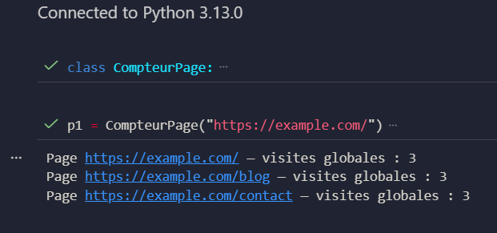
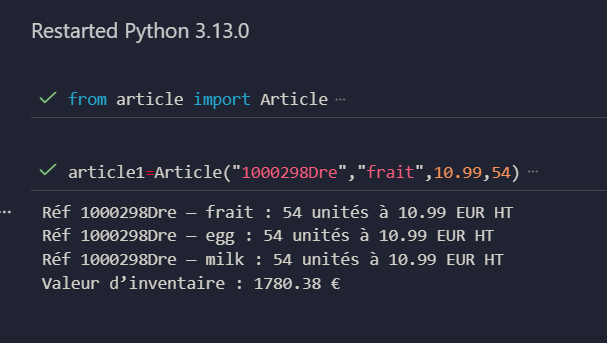
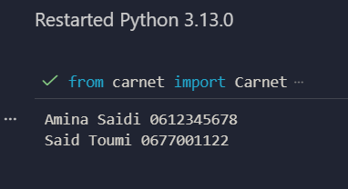
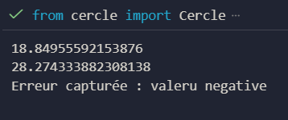
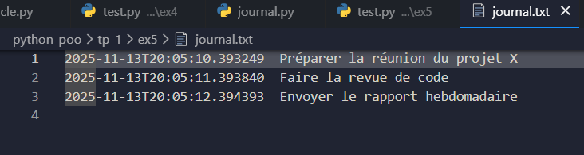
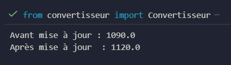

# Projet Python — Exercices POO et Gestion de Données

---

### Exercice 1 — Compteur de visites de pages

#### Objectif
Distinguer les attributs de classe et les attributs d’instance, et suivre le nombre de visites globales des pages.

#### Fonctionnalités
- Suivi global du nombre de visites pour toutes les pages.
- Affichage des statistiques pour chaque page individuellement.

#### Résultat

---

### Exercice 2 — Gestion d’inventaire d’articles

#### Objectif
Encapsuler les données des articles et calculer la valeur totale du stock.

#### Fonctionnalités
- Stockage des informations des articles : référence, désignation, prix HT, stock.
- Calcul de la valeur du stock de chaque article.
- Affichage détaillé et lisible des articles.
- Calcul de la valeur totale de l’inventaire.

#### Résultat

---

### Exercice 3 — Carnet d’adresses minimal

#### Objectif
Travailler avec des listes d’objets, des propriétés et effectuer des recherches sur les contacts.

#### Fonctionnalités
- Gestion d’une liste de contacts.
- Ajout de contacts dans le carnet.
- Recherche de contacts contenant un fragment dans le nom.
- Affichage de tous les contacts.
- Propriété pour récupérer la première lettre du nom en majuscule.

#### Résultat

---

### Exercice 4 — Calculatrice géométrique pour cercles

#### Objectif
Sécuriser l’accès aux attributs avec des propriétés et calculer des valeurs géométriques dynamiquement.

#### Fonctionnalités
- Contrôle de l’attribut rayon pour éviter les valeurs négatives ou nulles.
- Calcul dynamique du périmètre et de la surface.
- Affichage des résultats des calculs géométriques.

#### Résultat

---

### Exercice 5 — Journal de tâches avec gestion de contexte

#### Objectif
Exploiter `with` pour ouvrir et fermer automatiquement un fichier tout en enregistrant les tâches.

#### Fonctionnalités
- Enregistrement des tâches dans un fichier texte.
- Chaque tâche est précédée de sa date et heure au format ISO.
- Fermeture automatique du fichier grâce au gestionnaire de contexte.

#### Résultat

---

### Exercice 6 — Convertisseur de devises

#### Objectif
Illustrer les méthodes statiques et de classe pour effectuer des conversions monétaires et mettre à jour les taux globalement.

#### Fonctionnalités
- Conversion d’euros en dirhams via méthode statique.
- Mise à jour globale du taux de conversion via méthode de classe.
- Séparation claire entre opérations de classe et d’instance.

#### Résultat

